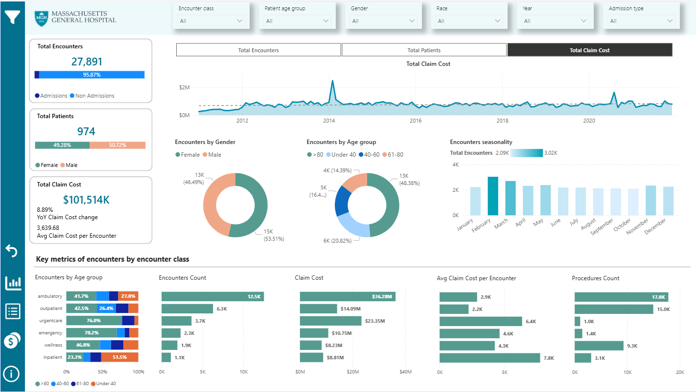
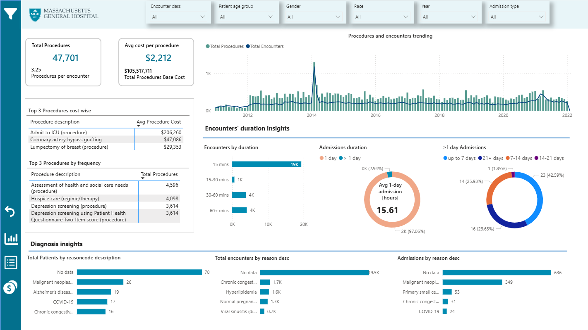
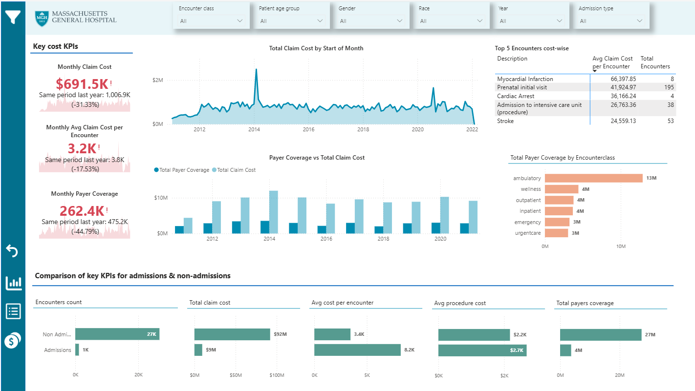
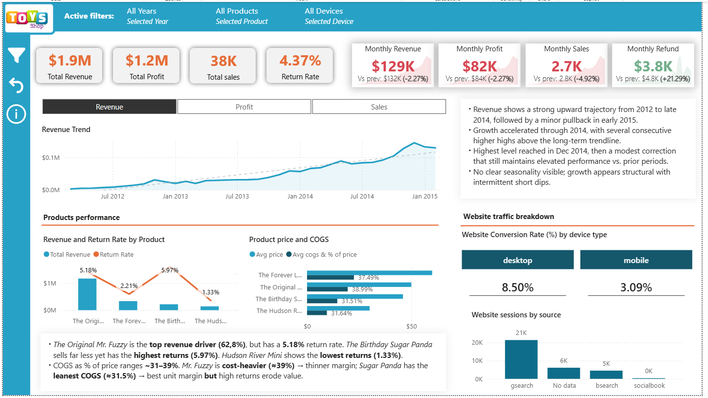

# 1. Massachusetts General Hospital (MGH) Executive KPI Dashboard (Power BI)

This project presents a high‑level KPI dashboard designed for the executive leadership team of a hospital. The report provides a clear, data‑driven view of recent operational performance using a curated subset of patient records. Its purpose is to help stakeholders quickly assess trends, identify areas requiring attention, and support strategic decision‑making.

---

## 📊 Overview

The dashboard consolidates key performance indicators across critical hospital functions, including patient flow, operational efficiency, and patients' structure. It is optimized for executive‑level consumption, emphasizing clarity and simplicity.

---

## 🔑 Key Features

- **Patient Volume Trends**  

- **Average Length of Stay (ALOS)**  

- **Seasonality**  

- **Claim cost analysis**  

- **Payers coverage insight**  

- **Patient Demographics**  

---

## 🛠️ Tools & Techniques

- **Power BI Desktop** for data modeling and visualization  
- **DAX Measures** for KPI calculations  
- **Data Cleaning & Transformation** using Power Query  
- **Star Schema Modeling** for optimized performance  
- **Executive‑level UX Design** focused on clarity and readability  

---

## 📸 Dashboard Preview

[Massachussets General Hospital.pdf](https://github.com/koteckaagata-commits/powerbi-portfolio/blob/main/Massachussets%20General%20Hospital.pdf)

- **Executive Summary**
  

- **Encounters & Procedures Details**
  

- **Cost Details**
  

## 📁 Repository Contents

- **Massachussets General Hospital.pbix** – Power BI report file  
- **Screenshots** – static previews of report pages  
- **README.md** – project documentation 

---

# 2. Toy Store Executive Dashboard (Power BI)

---

## 📊 Overview

This project showcases an interactive Power BI executive dashboard built for a fictional toy store. The dashboard provides a comprehensive, high‑level view of business performance across revenue, profitability, product trends, and website traffic. It is designed for decision‑makers who need fast, intuitive insights into operational and financial health.

The dataset simulates multi‑year sales activity and includes product‑level metrics, return rates, cost structures, and digital engagement data.

---

## 🔑 Key Features

- **Executive KPIs**:  A clean, high‑level summary of the store’s core performance indicators

- **Monthly Performance Tracking**:  This allows quick identification of short‑term trends and operational shifts

- **Revenue Trend Analysis**: A multi‑year line chart visualizing revenue from 2012 to 2015, A narrative insight box summarizes the trend for executive clarity  

- **Product Performance Insights**  

- **Website Traffic & Conversion**:  This section helps correlate online behavior with sales outcomes.  
 

---

## 🛠️ Tools & Techniques

- **Power BI Desktop** for data modeling and visualization  
- **DAX Measures** for KPI calculations  
- **Data Cleaning & Transformation** using Power Query for data shaping
- **Star Schema Modeling** for optimized performance  
- **Executive‑level UX Design** focused on clarity and readability  

---

## 📸 Dashboard Preview

- **Executive Summary**
  

---

## 📈 Purpose of the Project

This dashboard was created to:

- Demonstrate Power BI data modeling and visualization skills

- Provide a realistic executive‑level analytics experience

- Showcase storytelling through data

- Serve as a portfolio piece for analytics, BI, or data visualization roles
