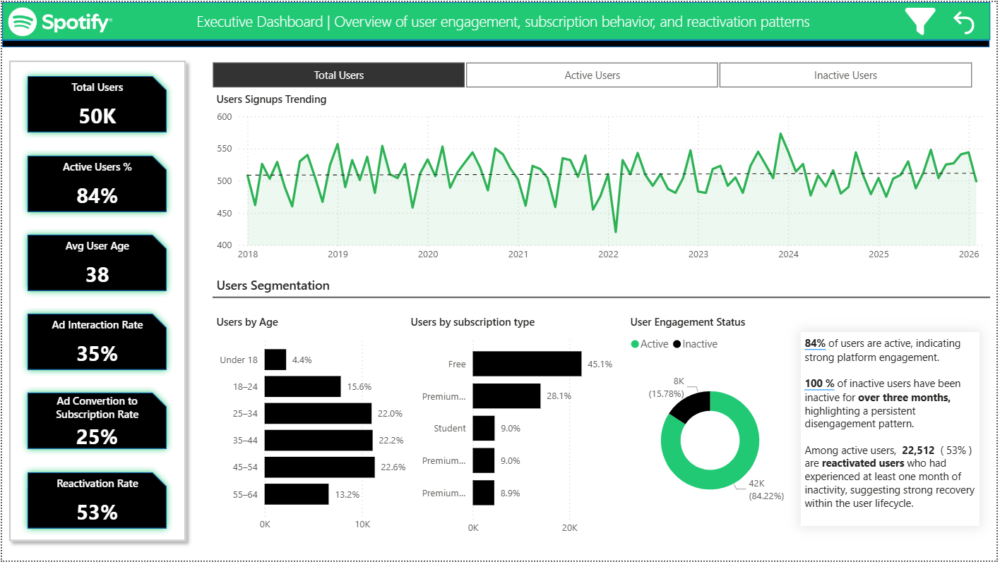
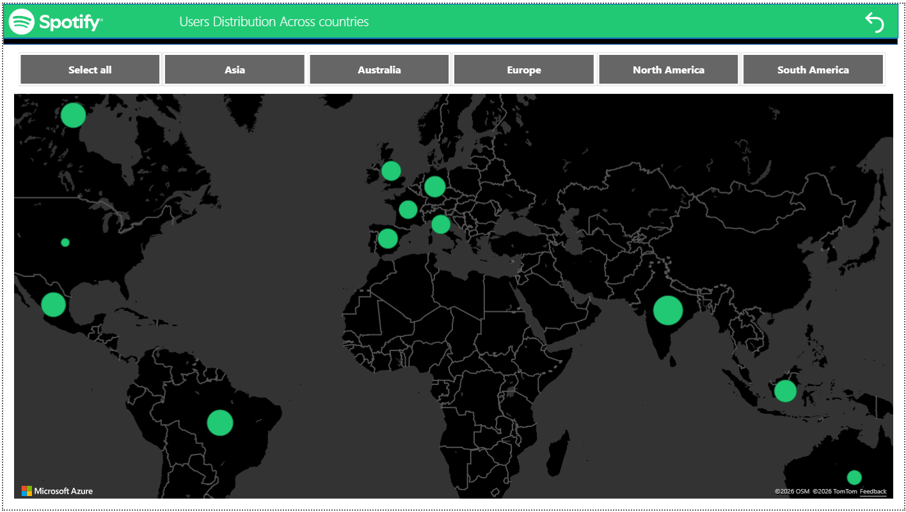
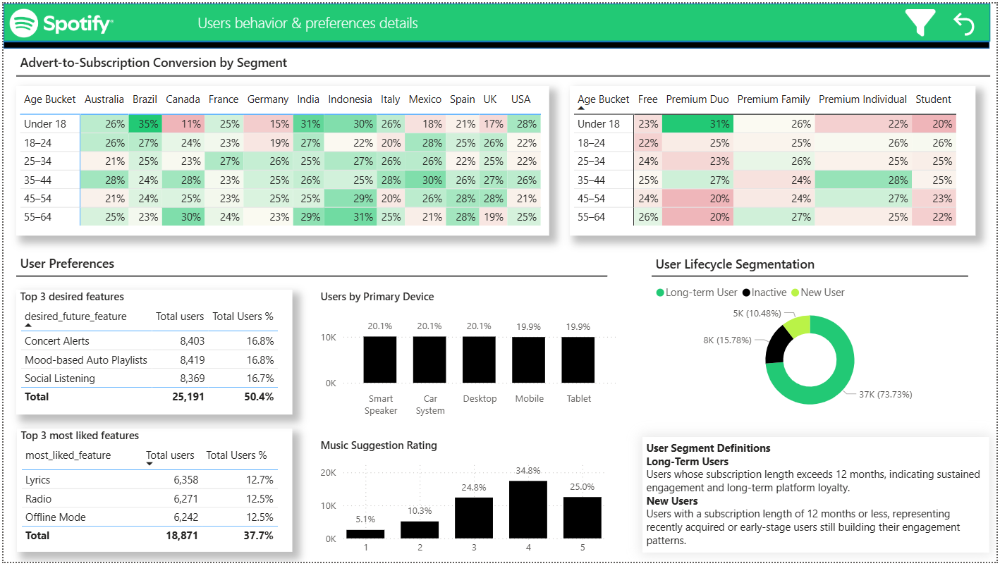

# 📊 Power BI Portfolio — Analytics Projects

Welcome to my Power BI portfolio. This repository showcases multiple end‑to‑end analytics projects built in Power BI, demonstrating skills in data modeling, DAX, visualization design, and executive‑level storytelling.
Each project includes a curated report with clear business insights and polished dashboards.

---

## 📌 Table of Contents
1. [Massachusetts General Hospital](#1-massachusetts-general-hospital) — Healthcare Analytics
2. [Spotify Users Analytics Report](#2-spotify-users-analytics-report) — User Engagement & Behavioral Analytics
3. [Toy Store Executive Dashboard](#3-toy-store-executive-dashboard) — Store’s Core Performance Indicators
4. [Tools & Techniques](#tools--techniques)

---

## 1. Massachusetts General Hospital

This project presents a high‑level KPI dashboard designed for the executive leadership team of a hospital. The report provides a clear, data‑driven view of recent operational performance using a curated subset of patient records. Its purpose is to help stakeholders quickly assess trends, identify areas requiring attention, and support strategic decision‑making.

---

## 📊 Overview

The dashboard consolidates key performance indicators across critical hospital functions, including patient flow, operational efficiency, and patients' structure. It is optimized for executive‑level consumption, emphasizing clarity and simplicity.

---

## 🔑 Key Features

- **Patient Volume Trends**  

- **Average Length of Stay (ALOS)**  

- **Seasonality**  

- **Claim cost analysis**  

- **Payers coverage insight**  

- **Patient Demographics**  

---

## 📸 Dashboard Preview
- **PDF version**

[Massachussets General Hospital.pdf](https://github.com/koteckaagata-commits/powerbi-portfolio/blob/main/Massachussets%20General%20Hospital.pdf)

- **Executive Summary**
  

- **Encounters & Procedures Details**
  

- **Cost Details**
  

---

## 2. Spotify Users Analytics Report

This project presents a multi‑page Power BI report built on an artificial Spotify‑style dataset. The goal is to demonstrate end‑to‑end BI skills: data modeling, DAX, visualization design, user segmentation, and executive‑level storytelling.

---

## 📊 Overview

The report consists of three main pages, each focusing on a different analytical angle:

- **Executive Dashboard** - This page provides a high‑level summary of platform performance and user engagement. It is designed for quick decision‑making and highlights the most important KPIs.

- **Global User Distribution (Map)** - This page visualizes where users are located geographically.

- **User Preferences & Behavior** - This page focuses on how users interact with the platform and what they value most.

---

## 📸 Dashboard Preview

- **PDF version**
  
[Spotify_report.pdf](https://github.com/koteckaagata-commits/powerbi-portfolio/blob/main/Spotify_report.pdf)

- **Executive Summary**
  
  

- **Global User Distribution (Map)**
  
  

- **User Preferences & Behavior**
  
  

---

## 🎯 Purpose of the Project
- Demonstrate strong BI design and storytelling

- Build a clean, executive‑ready dashboard

- Showcase segmentation, behavioral analytics, and conversion insights

- Present a cohesive multi‑page report with consistent design and narrative flow

---

## 3. Toy Store Executive Dashboard

## 📊 Overview

This project showcases an interactive Power BI executive dashboard built for a fictional toy store. The dashboard provides a comprehensive, high‑level view of business performance across revenue, profitability, product trends, and website traffic. It is designed for decision‑makers who need fast, intuitive insights into operational and financial health.

The dataset simulates multi‑year sales activity and includes product‑level metrics, return rates, cost structures, and digital engagement data.

---

## 🔑 Key Features

- **Executive KPIs**:  A clean, high‑level summary of the store’s core performance indicators

- **Monthly Performance Tracking**:  This allows quick identification of short‑term trends and operational shifts

- **Revenue Trend Analysis**: A multi‑year line chart visualizing revenue from 2012 to 2015, A narrative insight box summarizes the trend for executive clarity  

- **Product Performance Insights**  

- **Website Traffic & Conversion**:  This section helps correlate online behavior with sales outcomes.  
 

---

## 📸 Dashboard Preview

- **Executive Summary**
  

---

## 📈 Purpose of the Project

This dashboard was created to:

- Demonstrate Power BI data modeling and visualization skills

- Provide a realistic executive‑level analytics experience

- Showcase storytelling through data

- Serve as a portfolio piece for analytics, BI, or data visualization roles

---

## Tools & Techniques
- Power BI Desktop  
- DAX (advanced measures, time intelligence, segmentation logic)
- Power Query  (data shaping & transformation)
- Data modeling  (star schema, relationships, calculated tables)
- Visualization Design (executive dashboards, storytelling, UX)
- Artificial datasets for realistic business scenarios
